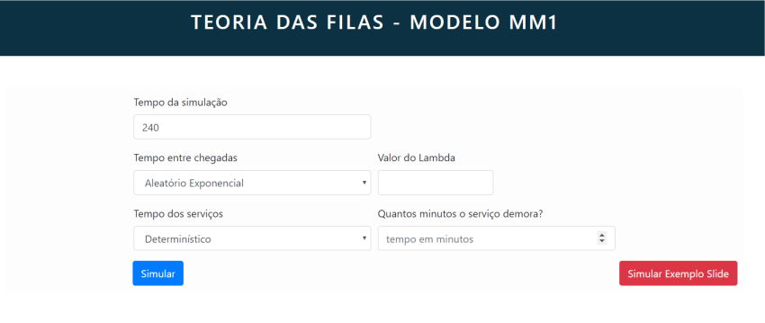

# Simulador de Fila M/M/1

Essa é uma aplicação web que permite a modelagem e simulação de um projeto utilizando o modelo de fila M/M/1, permitindo que o usuário acompanhe a evolução da simulação por meio de gráficos e da tabela de simulação.

<br>

## Pré requisitos
Verifique se já possui *npm* e *node* instalados:
```bash
npm -v
node -v
```

Caso não possua, basta instalá-los:
- npm: `npm install -g`
- [node](https://nodejs.org/en/download/)


## Iniciando a aplicação

Primeiro instale as dependências:
```bash
cd Simulador-MS
npm install
```

Depois rode a aplicação:

```bash
npm run dev
```

Agora é só abrir o navegador no endereço [localhost:5000](http://localhost:5000) e pronto, o app está rodando.

<br>

## Documentação

### O que é simulação?
É o processo de projetar um modelo de um sistema real e conduzir experimentos com este modelo para: 
- compreender o comportamento do sistema
- avaliar estratégias para a sua operacionalidade
(Shannon, 1975)

### O que é uma fila M/M/1?
Uma fila M/M/1 representa o comprimento de fila em um sistema que tem *um único servidor atende os clientes*. Além disso, possui tempo de atendimento exponencial (taxa µ) e intervalo exponencial entre as chegadas (taxa λ), definidas de acordo com um [processo de Poisson](https://pt.wikipedia.org/wiki/Processo_de_Poisson).

Vale ressaltar que é um processo estocástico (algumas variáveis de estado são randomicas) cujo espaço de estados é o conjunto {0, 1, 2, 3...} em que o valor corresponde ao número de clientes no sistema, incluindo aqueles que estão sendo servidos.
O diagrama de estado abaixo demonstra o funcionamento de uma fila M/M/1:
<br>


### Configurando a simulação
É possivel configurar o *tempo de duração da simulação*, o *intervalo de tempo entre chegadas (taxa λ)* e o *tempo do serviço/atendimento (taxa µ)*, conforme demonstrado abaixo:
<br>

*NOTA: Caso queira um exemplo pré definido de simulação basta clicar em "Simular Exemplo Slide"*

### Gráficos
Esta aplicação conta com gráficos que auxiliam o usuário a acompanhar a evolução da simulação e ter acesso a importantes informações, conforme exemplo abaixo:
<br>


### Tabela de Simulação
O usuário poderá acompanhar todas as informações da simulação por meio da *Tabela de Simulação*, conforme exemplo abaixo:
<br>


